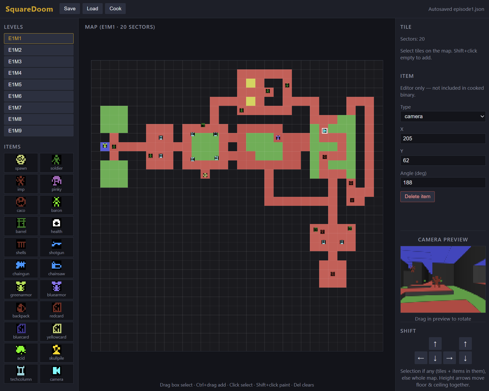

# Square Doom

A Doom-lite for the stock Commodore 64.

This differs from my vicdoom port in that the map is a grid like Wolfenstein, but there are floor and ceiling heights and "textured" floors and ceilings to make this look much more like Doom.

It's fullscreen, using dither patterns to allow for lighting, so the pixel grid is just 40x25, which is a little rough.

The huge advantage of the tile grid is ray casting is much faster, and so is wall collision. Doors and elevators are also tile-based. Even Wolfenstein-style mid-tile doors are kind of expensive, plus I wanted double wide doors and elevators. Floor heights are snapped to approximately half a meter, but the framerate is low enough that moving doors and elevators look reasonable.

I wrote an editor for this first, much like the editor I wrote for vicdoom (with the same sprites), but with height tweaking and a preview panel. Also, written in javascript instead of Adventure Game Studio.

Enemy logic, map, sound effects brought in wholesale from vicdoom and thekeep.

I had already experimented with squeezing the Doom levels into 32x32 tiles some time ago, so I knew that would work. Having a preview panel is super helpful for quickly matching the heights.

# Tech

The renderer is broken down into a few steps. I profile them separately (setup, DDA, wallz, near, ledge, project Y, items) without trying to turn the whole thing into a real pipeline.

## Setup

The screen buffer is transposed, so each column is a contiguous block of memory. When the look angle changes I rebuild a per-column ray cache (step sizes and fisheye-scaled depth deltas). Multiplies use table-based mid-products.

## DDA

A standard DDA walks the tile grid. Same-looking sectors get a cheap advance; when the floor, ceiling, or colours change I stop to paint. Depth is tracked incrementally with the fisheye scale already baked in, so later stages can just shift it to scale it.

## Render near

This is a floor and ceiling fill. Floors and ceilings aren't depth shaded; that would need a depth per pixel or per span, and at this resolution that's almost the same thing and I decided (for now...?) it isn't worth it. Instead, I just draw the flats with a dark colour, unless they are toxic sludge or the sky, which are supposed to glow.

## Render ledge

This fills steps and solid walls between sectors. Distance picks the dither pattern; walls are orange or brown depending on north-south vs east-west, Wolfenstein-style.

## Project Y

This converts a world height into a screen row relative to the horizon. Normally that would be a divide, or a sum-until like The Keep. With only a dozen or so possible rows I use a lookup table for the common mid-distance cases.

## Items

While casting I remember which sectors were seen and keep a clip stack per column. Every newly traversed sector is pushed with the current column aperture (`ytop`/`ybot` at push time — post-ledge after hard portals). Soft same-flat steps use push-if-new so each sector id stays findable. Items and enemies in visible sectors get projected, depth-sorted, and clipped against that stack. Mip maps keep distant billboards from looking too noisy.

Billboard projection (centre column, height, and feet row) uses a 65536/z reciprocal table plus fast table multiplies instead of a divide - the same approach as Andreas Larsson's C64 Doom workstage / Andropolis portal engine. Sprite U mapping caches recip[W] once per billboard; V walks an 8.8 DDA (mip_h/H per row) so a tall strip is adds, not per-row divides.

## Blit

A compact column-loop blit (~300 bytes) re-transposes colour + pattern together: X = column, 25 rows unrolled. About 23 ms vs 16 ms for a fully unrolled blit (12K). The HUD and pickup messages are painted into the transposed framebuffer, then the blit copies everything.

# To do list

This is more for me than you, the reader.

## Per sector wall colours

I think it would be pretty cheap to add NS/EW wall colours per sector.
Also, to add dither patterns per colour, both for the walls and the flats.
That would give an almost textured look. Of course it would need some decent art.
The limit here is the content, not the tech.

## Music

Try recruiting @Nordischsound?
Probably still need a SID player.
At least need a budget. Maybe <1ms per frame is good enough?

## Pickups

Need the smaller pickups (health, armour, clip) and so on.
Or just put weapons everywhere instead for the ammo.

## Levels

Finish levels :)
Almost half way there...
All laid out, just need polish.

## Weapons

- Animate the weapons in and out.

## Misc

- player death pause